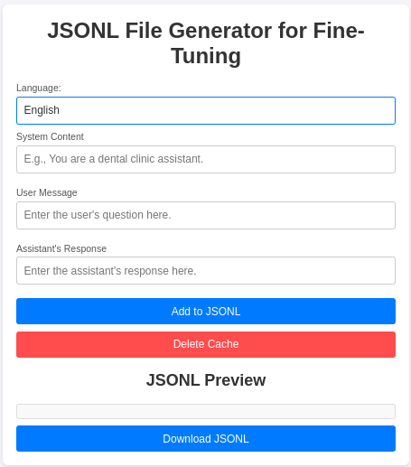

# JSONL File Generator for Fine-Tuning with Language Support

This is a FORK from https://github.com/iagolirapasssos/JSONL-File-Generator that drops the System message, and that adds the batch creation function from JSON files. Ideal if you want to generate a JSONL file for fine tuning a JSON Generator.

This is a simple web application that allows users to create JSONL files for fine-tuning OpenAI's GPT models. The application includes fields for entering "User", and "Assistant" messages, stores data in the browser's local storage to prevent data loss on refresh, and supports multiple languages (English, Portuguese, Spanish, and Hindi). Users can download the generated JSONL file directly from the app.



## Features

- **Easy JSONL Creation**: Provides structured fields for entering user messages, and assistant responses.
- **Batch create from JSON Files**: Allows you to create user message and responses in batch from JSON files. 
- **Downloadable File**: Creates a JSONL format file for OpenAI's fine-tuning, which can be downloaded with one click.
- **Local Storage Support**: Retains input data in local storage to avoid data loss on page refresh.
- **Multilingual Support**: Interface available in English, Portuguese, Spanish, and Hindi.
- **Cache Deletion**: Option to clear cached data from local storage.

## Getting Started

### Prerequisites
- A modern web browser.

### Installation
1. Clone this repository:
   ```bash
   git clone https://github.com/your-username/jsonl-file-generator.git
   ```
2. Open `index.html` in your browser to start using the application.

### Usage

1. **Select Language**: Choose the desired language from the dropdown.
2. **Fill in Fields**:
   - Enter context in the "System Content" field.
   - Add user input in the "User Message" field.
   - Provide assistant responses in the "Assistant's Response" field.
3. **Add to JSONL**: Click the "Add to JSONL" button to save the entry to the preview list.
4. **Download JSONL File**: Once all entries are added, click "Download JSONL" to save the file.
5. **Clear Cache**: Use the "Delete Cache" button to clear all saved data from local storage.

## File Structure

- `index.html`: The main HTML file with the structure of the application.
- `script.js`: JavaScript for functionality, including adding entries, saving to local storage, downloading JSONL, and managing language changes.
- `styles.css`: CSS file for styling the interface, including custom styles for input fields, buttons, and the language selector.

## Example JSONL Output

Here's an example of the generated JSONL format:

```jsonl
{"messages": [{"role": "user", "content": "What are the clinic hours?"}, {"role": "assistant", "content": "Our clinic is open from 8 AM to 6 PM, Monday to Friday."}]}
{"messages": [{"role": "user", "content": "How can I book an appointment?"}, {"role": "assistant", "content": "You can book an appointment by calling us or through our website."}]}
```

## Customization

- **Add More Languages**: Modify the `translations` object in `script.js` to add more languages.
- **Update Styling**: Edit `styles.css` for custom appearance.

## Contributing

Feel free to submit issues or pull requests. We welcome contributions to improve the app, add more features, or enhance language support.

## License

This project is licensed under the MIT License. See the [LICENSE](LICENSE) file for details.

## Contact

For any questions or feedback, please open an issue on this repository.

